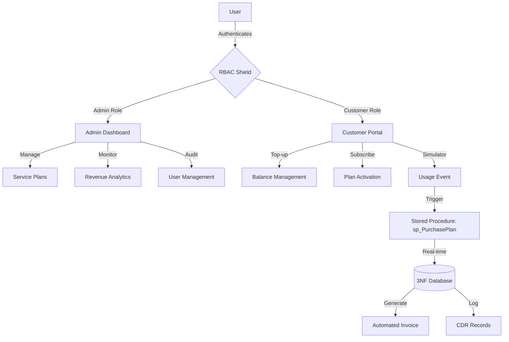

<div align="center">
  
  <h1>Telecom Connect</h1>
  <p><strong>Enterprise-Grade Telecom Billing & Customer Management Suite</strong></p>

  [](https://opensource.org/licenses/MIT)
  [](https://reactjs.org/)
  [](https://nodejs.org/)
  [](https://www.mysql.com/)
  [](https://www.docker.com/)
  [](https://github.com/HaseebAhmad24-collab/Telecom-Billing-System)
</div>

---

## 📖 Overview

**Telecom Connect** is a high-performance, containerized billing solution designed for modern telecommunications providers. Built on a strict **3NF relational database architecture**, it handles real-time usage metering (Voice, Data, SMS) with transactional integrity. The system provides a seamless experience for both administrators managing the network and customers controlling their services.

## 🛠️ Tech Stack

| Component | Technology | Role |
| :--- | :--- | :--- |
| **Frontend** | React 19 + Vite | SPA with Glassmorphism UI |
| **Backend** | Node.js + Express | RESTful API & Business Logic |
| **Database** | MySQL 8.0 | Stored Procedures, Triggers, 3NF |
| **Auth** | JWT + Bcrypt | Role-Based Access Control (RBAC) |
| **DevOps** | Docker + Compose | Automated Orchestration |

---

## 🔄 System Workflow



---

## 🌟 Key Features

### 🛡️ Secure Infrastructure
*   **Dual-Panel Architecture**: Physically and logically separated Admin and Customer modules.
*   **Session Guard**: 24-hour JWT token validation with automatic routing to prevent unauthorized access.
*   **Encrypted Records**: Industry-standard Bcrypt hashing for all sensitive credentials.

### 💳 Precision Billing Engine
*   **Hybrid Model**: Native support for both **Prepaid** and **Postpaid** lifecycle management.
*   **Micro-Metering**: Tracks usage down to 2 decimal places (Seconds for Voice, MBs for Data).
*   **Transactional Safety**: Uses MySQL `START TRANSACTION` to ensure zero data loss during concurrent usage events.

### 📊 Administrative Intelligence
*   **Live Metrics**: Real-time visualization of revenue streams and active subscriber counts.
*   **Dynamic CRM**: Full control over user state (Block/Unblock) and detailed profile auditing.
*   **Plan Factory**: Rapid deployment of new service plans through a streamlined CRUD interface.

### 📱 Customer Empowerment
*   **Digital Wallet**: Instant top-up and real-time subscription status.
*   **Usage Simulation**: Integrated sandbox to test Voice, SMS, and Data consumption.
*   **Invoicing**: One-click invoice generation and payment history.

---

## 🐳 Quick Start (Docker)

The fastest way to deploy the entire stack.

1. **Clone & Enter:**
   ```bash
   git clone https://github.com/HaseebAhmad24-collab/Telecom-Billing-System.git
   cd Telecom-Billing-System
   ```
2. **Launch Services:**
   ```bash
   docker compose up --build
   ```
3. **Endpoints:**
   *   **Frontend UI:** [http://localhost](http://localhost)
   *   **Backend API:** [http://localhost:5000](http://localhost:5000)
   *   **Database:** `localhost:3307` (Root: `rootpassword`)

---

## ⚡ Manual Setup (Development)

<details>
<summary>View Manual Setup Steps</summary>

### Prerequisites
- Node.js (v18+)
- MySQL Server 8.0

### Steps
1. **Database:** Import `database/schema.sql` and `database/seed.sql` into a fresh MySQL instance.
2. **Environment:** Setup `.env` files in `backend/` and `frontend/` as per the templates.
3. **Install & Run:**
   ```bash
   # Terminal 1: Backend
   cd backend && npm install && npm run dev

   # Terminal 2: Frontend
   cd frontend && npm install && npm run dev
   ```
</details>

---

## 📄 License
This project is licensed under the **MIT License**.

Designed & Developed by **Abdul Wahab**.
*Transforming Telecommunications through Code.*
